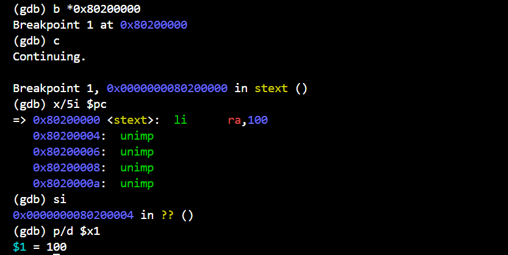

# rCore 实验一报告

## 1. 实验概述
本实验基于 `rCore-Tutorial` 实验指导手册，目标是理解 rCore 操作系统的基本框架，并成功运行 `ch1` 相关代码。

## 2. 代码理解
### 2.1 实验环境
- **开发环境**：
  - 操作系统：Ubuntu 24.04（WSL / 虚拟机）
  - 编程语言：Rust + RISC-V 交叉编译工具链
  - 主要依赖：`rustup`、`cargo`、`qemu`

- **代码结构分析**：
  ```markdown
  ├── os/
  │   ├── src/           # 内核源代码
  │   ├── Cargo.toml     # Rust 依赖管理
  │   ├── Makefile       # 编译脚本
  │   ├── target/        # 编译输出


## 3. 对实验指导手册内容的理解
### 3.1 对裸机平台（分层抽象）的理解

如上图所示，普通的应用程序是需要标准库提供的接口的，而标准库又依赖于操作系统提供的系统调用接口。我们要写一个裸机平台，就要移除上层的这些接口，要使用硬件平台提供的指令集进行编写，即我们不能使用标准库std,而是要使用核心库core。

指导书中有一句话很有意思：计算机科学中遇到的所有问题都可通过增加一层抽象来解决（All problems in computer science can be solved by another level of indirection）。操作系统本身就是这句话很好的一个证明案例。由于操作计算机硬件（如 CPU、硬盘、网络）非常复杂，不同硬件的控制方式也不同。操作系统提供了 “系统调用” 作为抽象层，应用程序不再直接访问硬件，而是通过标准化的 API（如 Linux 的 read()、write()）来操作文件系统或网络设备。当然，除此之外还有虚拟内存、垃圾回收等等抽象机制。

### 3.2 程序的内存布局的理解

这部分需要掌握一些基础知识，知道每个段存放了哪些东西，以及段与段的相对顺序。比如已初始化数据段保存程序中那些已初始化的全局数据，分为 .rodata 和 .data 两部分。未初始化数据段 .bss 保存程序中那些未初始化的全局数据，堆 （heap）区域用来存放程序运行时动态分配的数据，栈 （stack）区域不仅用作函数调用上下文的保存与恢复，个函数作用域内的局部变量也被编译器放在它的栈帧内，它向低地址增长。

段与段的相对位置如图片中所示。

### 3.3 函数的调用与栈
这里回答一下指导书上的六个问题：
1 如何使得函数返回时能够跳转到调用该函数的下一条指令，即使该函数在代码中的多个位置被调用？
答：函数调用时，返回地址压入到函数调用的栈中，然后执行函数的指令，直到ret时，返回地址弹出栈，然后PC获得这个地址，执行下一条指令

2 对于一个函数而言，保证它调用某个子函数之前，以及该子函数返回到它之后（某些）通用寄存器的值保持不变有何意义？
答：维护寄存器的值在函数调用前后不变

3 调用者函数和被调用者函数如何合作保证调用子函数前后寄存器内容保持不变？调用者保存和被调用者保存寄存器的保存与恢复各自由谁负责？它们暂时被保存在什么位置？它们于何时被保存和恢复（如函数的开场白/退场白）？
答：调用者函数负责保存调用者保存寄存器，被调用者函数负责保存被调用者保存寄存器。被保存在栈中。调用者保存寄存器在函数被调用之前保存，在函数调用完之后恢复；被调用者保存寄存器在函数被调用之后保存，在函数调用完之前恢复。

4 在 RISC-V 架构上，调用者保存和被调用者保存寄存器如何划分的？

如上图所示

5 sp 和 ra 是调用者还是被调用者保存寄存器，为什么这样约定？
答：ra( x1 ) 是被调用者保存的。被调用者函数可能也会调用函数，在调用之前就需要修改 ra 使得这次调用能正确返回。因此，每个函数都需要在开头保存 ra 到自己的栈帧中，并在结尾使用 ret 返回之前将其恢复。栈帧是当前执行函数用于存储局部变量和函数返回信息的内存结构。sp( x2 ) 是被调用者保存的。这个是之后就会提到的栈指针 (Stack Pointer) 寄存器，它指向下一个将要被存储的栈顶位置。

6 如何使用寄存器传递函数调用的参数和返回值？如果寄存器数量不够用了，如何传递函数调用的参数？
答： RISC-V 64-bit中，前 8 个整数参数存入 a0 - a7，额外参数存入栈，浮点参数存入 fa0 - fa7。数量不够了可以用栈传递。
## 4. 实践作业的完成过程及运行结果
### 4.1 移除标准库依赖
在 os 目录下新建 .cargo 目录，并在这个目录下创建 config 文件，并在里面输入如下内容：
```rust
os2/.cargo/config
[build]
target = "riscv64gc-unknown-none-elf"
```

创建lang_items.rs并提供panic_handler

```rust
use core::panic::PanicInfo;

#[panic_handler]
fn panic(_info: &PanicInfo) -> ! {
    loop {}
}
```
main函数中引入mod lang_items;
结果如下：


### 4.2 内核初始化
```rust
#os/src/entry.asm
     .section .text.entry
     .globl _start
 _start:
     li x1, 100
```

```rust
# main.rs写入
#![no_std]
#![no_main]

mod lang_items;

use core::arch::global_asm;
global_asm!(include_str!("entry.asm"));
```
再完成link.ld脚本保证能正确链接

最后使用gdb验证


### 4.3 分配并使用启动栈
```rust
#os/src/entry.asm
    .section .text.entry
    .globl _start
_start:
    la sp, boot_stack_top
    call rust_main

    .section .bss.stack
    .globl boot_stack_lower_bound
boot_stack_lower_bound:
    .space 4096 * 16
    .globl boot_stack_top
boot_stack_top:
```
```rust
# main.rs
pub fn rust_main() -> ! {
    clear_bss();
    loop {}
}

fn clear_bss() {
    extern "C" {
        fn sbss();
        fn ebss();
    }
    (sbss as usize..ebss as usize).for_each(|a| {
        unsafe { (a as *mut u8).write_volatile(0) }
    });
}
```
### 4.4 实现输出和关机
关键代码：
```rust
pub fn console_putchar(c: usize) {
    #[allow(deprecated)]
    sbi_rt::legacy::console_putchar(c);
}

pub fn shutdown(failure: bool) -> ! {
    use sbi_rt::{system_reset, NoReason, Shutdown, SystemFailure};
    if !failure {
        system_reset(Shutdown, NoReason);
    } else {
        system_reset(Shutdown, SystemFailure);
    }
    unreachable!()
}

#[macro_export]
macro_rules! print {
    ($fmt: literal $(, $($arg: tt)+)?) => {
        $crate::console::print(format_args!($fmt $(, $($arg)+)?));
    }
}

#[macro_export]
macro_rules! println {
    ($fmt: literal $(, $($arg: tt)+)?) => {
        $crate::console::print(format_args!(concat!($fmt, "\n") $(, $($arg)+)?));
    }
}
```

成功输出helloworld并关机

### 4.5 实现彩色输出并分级
#### 4.5.1 实现Makefile
在此之前，我并不懂Makefile的写法，于是我用把QEMU命令交给AI，让他先帮我生成了下面的Makefile，至少让make run能够先跑起来
```Makefile
# 交叉编译工具链
CARGO = cargo
OBJCOPY = rust-objcopy

# 目标架构
TARGET = riscv64gc-unknown-none-elf

# OS 可执行文件路径
KERNEL_ELF = target/$(TARGET)/release/os2
KERNEL_BIN = $(KERNEL_ELF).bin

# RustSBI Bootloader 路径
RUSTSBI = ./bootloader/rustsbi-qemu.bin

# 日志级别
LOG ?= INFO
RUSTFLAGS += --cfg log_level=\"$(LOG)\"

# QEMU 运行参数
QEMU = qemu-system-riscv64
QEMU_ARGS = -machine virt -nographic -bios $(RUSTSBI) -device loader,file=$(KERNEL_BIN),addr=0x80200000

# 默认目标
all: build

# 构建 OS
build:
	@$(CARGO) build --release --target $(TARGET)

# 转换 ELF 到 BIN
objcopy: build
	@$(OBJCOPY) --strip-all -O binary $(KERNEL_ELF) $(KERNEL_BIN)

# 运行 QEMU
run: objcopy
	@$(QEMU) $(QEMU_ARGS)

# 清理
clean:
	@$(CARGO) clean
	@rm -f $(KERNEL_BIN)

```
make run现在能跑了，不过还没实现分级和颜色

#### 4.5.2 实现彩色log分级输出
我查找了前人的资料，发现要实现这个功能需要两步。第一是实现一个Log方法，第二是通过option_env获取LOG=参数，根据参数选择输出等级

首先是实现Log
```rust
truct SimpleLogger;

impl Log for SimpleLogger {
    fn enabled(&self, _metadata: &Metadata) -> bool {
        true
    }
    fn log(&self, record: &Record) {
        if !self.enabled(record.metadata()) {
            return;
        }
        let color = match record.level() {
            Level::Error => 31, // Red
            Level::Warn => 93,  // BrightYellow
            Level::Info => 34,  // Blue
            Level::Debug => 32, // Green
            Level::Trace => 90, // BrightBlack
        };
        println!(
            "\u{1B}[{}m[{:>5}] {}\u{1B}[0m",
            color,
            record.level(),
            record.args(),
        );
    }
    fn flush(&self) {}
}
```
其次是init函数
```rust
pub fn init() {
    static LOGGER: SimpleLogger = SimpleLogger;
    log::set_logger(&LOGGER).unwrap();
    log::set_max_level(match option_env!("LOG") {
        Some("ERROR") => LevelFilter::Error,
        Some("WARN") => LevelFilter::Warn,
        Some("INFO") => LevelFilter::Info,
        Some("DEBUG") => LevelFilter::Debug,
        Some("TRACE") => LevelFilter::Trace,
        _ => LevelFilter::Off,
    });
}
```
之后在主函数中输出
```rust
pub fn rust_main() -> u8 {
    clear_bss();
    console_putchar('c' as usize);
    println!("Hello, world!");
    init();
    log::info!("Kernel started!");
    log::warn!("Warning message!");
    log::error!("Error message!");
    log::debug!("Debug message!");
    log::trace!("Trace message!");
    // panic!("Shutdown machine!");
    1
}
```
尝试make run LOG=INFO，得到


尝试make run LOG=ERROR,得到


至此，实验完成
## 5. 遇到的问题及解决方法
### 5.1 gdb调试
执行下面的指令时遇到错误了错误
```sh
riscv64-unknown-elf-gdb \
    -ex 'file target/riscv64gc-unknown-none-elf/release/os2' \
    -ex 'set arch riscv:rv64' \
    -ex 'target remote localhost:1234'
```
错误信息：
```sh
riscv64-unknown-elf-gdb: command not found
```
通过询问AI得知安装指令
```sh
sudo apt update
sudo apt install gdb-multiarch
```
接下来就可以通过gdb-multiarch进行调试了


### 5.2 分级输出
我在LOG=()这个输入的参数这里踩了坑，AI告诉我要在Makefile里加上下面这样的代码
```Makefile
# 日志级别
LOG ?= INFO
RUSTFLAGS += --cfg log_level=\"$(LOG)\"
```
但是一直产生一些报错，
我在这里疑惑了很久，后面参考了rcore实验ch2中的代码，发现用env_option即可获取，看来AI还是不是万能的哈哈哈


