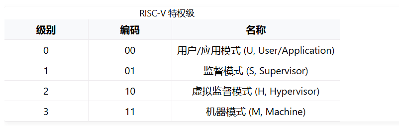
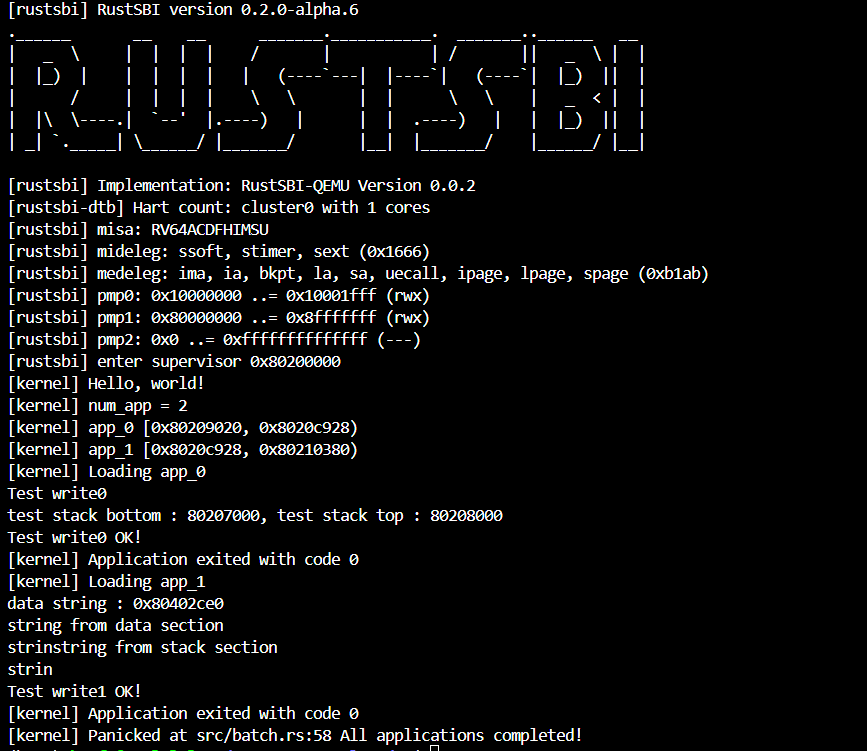

# rCore 实验二报告

## 1. 实验概述
本实验基于 `rCore-Tutorial` 实验指导手册，目标是理解 rCore 操作系统的基本框架，并成功运行 `ch2-lab` 相关代码。

## 2. 代码理解
### 2.1 实验环境
- **开发环境**：
  - 操作系统：Ubuntu 24.04（WSL / 虚拟机）
  - 编程语言：Rust + RISC-V 交叉编译工具链
  - 主要依赖：`rustup`、`cargo`、`qemu`

- **代码结构分析**：
  ```markdown
  ├── os/
  │   ├── src/           # 内核源代码
  │   ├── Cargo.toml     # Rust 依赖管理
  │   ├── Makefile       # 编译脚本
  │   ├── target/        # 编译输出


## 3. 对实验指导手册内容的理解
### 3.1 特权级机制
这一章最重要的就是特权级机制。RISCV定义了4种特权级架构。

不同的特权级之间是通过trap捕获的。在trap.S会通过call trap_handler函数，对应不同的trap原因来调用不同的trap_handler方法。
在trap_handler的代码实现中，可以看到作者实现了对以下几种原因的trap_handler:用户态的系统调用，存储错误，非法指令，以及默认处理。

### 3.2 从机器上电开始到第一个应用程序经历了哪些关键阶段
#### 3.2.1 机器上电和引导加载
当计算机通电时，硬件设备开始初始化，电源供应器（PSU）提供稳定的电压给主板和其他组件。
处理器（CPU）被复位，并开始执行固化在只读存储器（如BIOS/）中的启动代码。在rcore实验中，bootloader中以及给定了写好的二进制bin文件代码，不需要自己动手编写。在更加现代的操作系统中，会使用UEFI ROM代替BIOS。bootloader中的二进制代码负责找到操作系统内核（kernel），并将其加载到内存中。

#### 3.2.2 操作系统内核初始化
在内核被加载到内存之后，内核会运行自己的初始化代码。rcore的实验中包括了clear_bss(),logging::init(),trap::init();，batch::init(),以及batch::run_next_app()开始转换到用户态，批处理用户态的应用程序。

其中值得注意的是，trap::init()将_alltrap函数的地址写入到stvec寄存器中，这样在系统trap的时候，硬件能够正确地跳转到trap处理的代码。

### 3.3 用户程序执行ecall指令时，硬件层到操作系统层的完整处理流程
在内核初始化的时候，通过trap::init()写入stvec寄存器。使得硬件能够找到trap.S的汇编代码。当用户套执行系统调用的时候，会调用汇编代码的ecall指令。读取 stvec 寄存器的值并跳转到 alltraps 处理函数的过程，是由硬件完成的。操作系统层则完成了 alltraps 处理函数的编写。alltraps编写在trap.S文件中，它会保存当前的一些上下文环境（x0--x31, sstatus寄存器，sepc寄存器）。之后就是call trap_handler, 通过match语句判断trap原因，此处是系统调用，sepc寄存器数值+4，使得返回时跳转到下一条指令。执行完之后便执行_restore函数，回复寄存器上下文，最后通过sret返回。将 sepc 复制到 pc，从而继续执行指令。

## 4. 实践作业的完成过程及运行结果
通过下面的打印语句
```rust
# user/src/bin/test1_write0.rs
println!("test stack bottom : {:x}, test stack top : {:x}", bottom, top);
```
以及通过APP_BASE_ADDRESS常量和APP_SIZE_LIMIT，我们可以得知栈和应用程序空间的地址。
所以我们只需要在写入之前加上对这两个地址空间的判断即可

输入make run TEST=1,运行结果如下：


## 5. 遇到的问题及解决方法
一开始我没有看到要切换lab分支，于是比对了许久，发现没有测试用例，再仔细一看题目，才恍然醒悟，下次做之前一定要先仔细看题目


