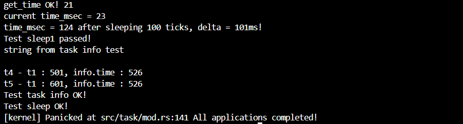

# rCore 实验二报告

## 1. 实验概述
本实验基于 `rCore-Tutorial` 实验指导手册，使用的是2024SP的代码框架，目标是理解 rCore 操作系统的基本框架，并成功运行 `ch3` 相关代码。

## 2. 代码理解
### 2.1 实验环境
- **开发环境**：
  - 操作系统：Ubuntu 24.04（WSL / 虚拟机）
  - 编程语言：Rust + RISC-V 交叉编译工具链
  - 主要依赖：`rustup`、`cargo`、`qemu`

- **代码结构分析**：
  ```markdown
  ├── os/
  │   ├── src/           # 内核源代码
  │   ├── Cargo.toml     # Rust 依赖管理
  │   ├── Makefile       # 编译脚本
  │   ├── target/        # 编译输出


## 3. 对实验指导手册内容的理解
### 3.1 多道程序的内存加载
不同于上一章的批处理系统，所有应用程序都加载到相同的内存地址空间，当一个程序运行完，它所占据的内存空间就全部让出，下一个应用程序加载进相同的一片内存空间。多道程序的每一个应用程序都采取不同的地址空间。这样能够避免在保存和切换任务上下文时所带来的巨大的环境切换的开销。
```rust
 fn get_base_i(app_id: usize) -> usize {
     APP_BASE_ADDRESS + app_id * APP_SIZE_LIMIT
 }
```


### 3.2 程序是如何分时跑起来的
#### 3.2.1 第一个程序是如何跑起来的
在main.rs中，我们看到调用了task::run_first_task();函数，在lazy_static初始化APP_MANAGER时，
```rust
for (i, task) in tasks.iter_mut().enumerate() {
            task.task_cx = TaskContext::goto_restore(init_app_cx(i));
            task.task_status = TaskStatus::Ready;
        }
```
把每一个task的task_cx初始化为
```rust
ra: __restore as usize,
            sp: kstack_ptr,
            s: [0; 12],
```
其中ra被初始化为trap.S中_restore函数的地址。在switch.S中ld ra, 0(a1)指令中，就会把_restore函数作为返回地址。之后就会执行_restore函数中的指令，恢复上下文，最后sret之后，就回到了用户态，第一个应用程序就成功跑起来了。
```rust
unsafe {
    __switch(&mut _unused as *mut _, next_task_cx_ptr);
}
```


#### 3.2.2 程序的分时运行
main.rs中，调用了下面的函数。
```rust
timer::set_next_trigger();
```
set_mext_trigger函数又会相继调用：
```rust
pub fn set_next_trigger() {
    set_timer(get_time() + CLOCK_FREQ / TICKS_PER_SEC);
}
```
设定了下一次时钟中断时间。实际上这个函数最后是进行了sbi的系统调用。就会执行ecall指令，然后就像第二章那样，陷入内核。进入trap_handler函数之后，match语句匹配系统调用类型，这里是时钟中断：
```rust
Trap::Interrupt(Interrupt::SupervisorTimer) => {
            set_next_trigger();
            suspend_current_and_run_next();
        }
```
这里很清楚地可以看到调用了设定下一次时钟中断，并且会开始运行下一个函数。这样就完成了分时切换应用程序的功能。


## 4. 实践作业的完成过程及运行结果
syscall_times的计数：
```rust
pub fn syscall(syscall_id: usize, args: [usize; 3]) -> isize {
    let mut inner = TASK_MANAGER.inner.exclusive_access();
    let current = inner.current_task;
    let current_task = &mut inner.tasks[current];
    current_task.syscall_times[syscall_id] += 1;
    drop(inner);
    match syscall_id {
        SYSCALL_WRITE => sys_write(args[0], args[1] as *const u8, args[2]),
        SYSCALL_EXIT => sys_exit(args[0] as i32),
        SYSCALL_YIELD => sys_yield(),
        SYSCALL_GET_TIME => sys_get_time(args[0] as *mut TimeVal, args[1]),
        SYSCALL_TASK_INFO => sys_task_info(args[0] as *mut TaskInfo),
        _ => panic!("Unsupported syscall_id: {}", syscall_id),
    }
}
```
在内核的syscall/mod.rs中，每次调用syscall函数时候，相应的数组在相应的索引下的次数就+1。这里要在TASK_CONTROL_BLOCK中增加一个syscall_times数组记录次数.

关于时间的计算, 在task/mod.rs中,在run_first_task函数和suspend_current_and_run_next函数中,每当下一个函数的状态被切换为Running时,就开始计时,然后在sys_task_info中再调用get_time_ms函数减掉开始的计时即可.
```rust
pub fn sys_task_info(_ti: *mut TaskInfo) -> isize {
    let mut inner = TASK_MANAGER.inner.exclusive_access();
    let current_id = inner.current_task;
    let current_task = &mut inner.tasks[current_id];
    // println!("current time: {} , last_start_time : {}", get_time_ms(), current_task.last_start_time);    
    current_task.task_time = get_time_ms() as usize;
    // current_task.last_start_time = get_time_ms() as usize;
    unsafe {
        *_ti = TaskInfo {
            status: current_task.task_status,
            syscall_times: current_task.syscall_times,
            time: current_task.task_time,
        };
    }
    0
}
```


成功运行测试用例截图如下：


## 5. 遇到的问题及解决方法
### 5.1 问题一：ch3-lab没有相应的分支
解决办法：向老师提出，有同学提出可以使用2024SP的版本

### 5.2 问题二：2024SP的qemu运行没有rustsbi图案
解决办法：通过qemu --version发现qemu的版本和rustsbi的bootloader版本不匹配，我的qemu是8.x.x的版本，相对较高。
于是想起来配置环境时，有qemu8.x.x的相关配置信息，于是做出相应修改，顺利运行。

### 5.3 问题三：时间计算过大/过小
解决办法：一开始我测量的时间比正确的测试用例（500ms）高了很多个数量级，于是怀疑是不是单位有问题，在网上查找资料，发现需要使用get_time_ms函数，而不是get_time函数。之后测量的又相对较小，仔细读题发现自己想复杂了。时间测量的是从程序运行就开始计算，而且不需要减去CPU分时到其他程序的时间。直接拿调用sys_task_info的get_time_ms获得的时间减去最开始的get_time_ms获得的时间即可通过测试用例。