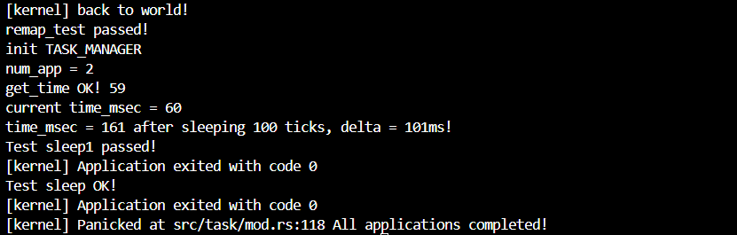
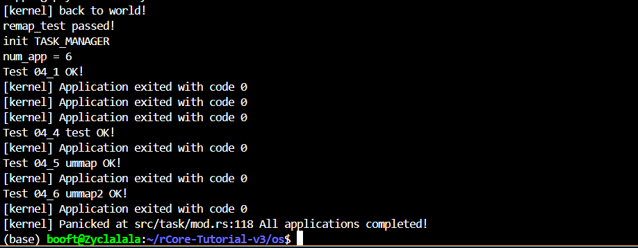

# rCore 实验二报告

## 1. 实验概述
本实验基于 `rCore-Tutorial` 实验指导手册，使用的是2024SP的代码框架，目标是理解 rCore 操作系统的基本框架，并成功运行 `ch3` 相关代码。

## 2. 代码理解
### 2.1 实验环境
- **开发环境**：
  - 操作系统：Ubuntu 24.04（WSL / 虚拟机）
  - 编程语言：Rust + RISC-V 交叉编译工具链
  - 主要依赖：`rustup`、`cargo`、`qemu`

- **代码结构分析**：
  ```markdown
  ├── os/
  │   ├── src/           # 内核源代码
  │   ├── Cargo.toml     # Rust 依赖管理
  │   ├── Makefile       # 编译脚本
  │   ├── target/        # 编译输出


## 3. 对实验指导手册内容的理解
### 3.1 动态内存分配
#### 3.1.1 智能指针
含瘦指针和胖指针，提供了多种基于堆的智能指针和容器类型，简化了动态内存管理.
Box<T>：​在堆上分配类型为 T 的值，提供对该值的独占所有权。​

Rc<T> 和 Arc<T>：​引用计数智能指针，允许多个所有者共享同一数据，Arc<T> 支持线程安全的共享。​

RefCell<T>：​提供内部可变性，允许在不可变上下文中修改其内部值，借用规则在运行时检查。

等等


#### 3.1.2 堆上的动态内存分配
使用了use buddy_system_allocator::LockedHeap;的对象进行初始化

同时完成了如下的分配错误回调函数
```rust
#[alloc_error_handler]
pub fn handle_alloc_error(layout: core::alloc::Layout) -> ! {
    panic!("Heap allocation error, layout = {:?}", layout);
}
```
### 3.2 地址空间
#### 3.2.1 地址空间的引入
在早期计算机系统中，应用程序直接使用物理内存地址，缺乏有效的内存保护机制。​随着多任务操作系统的发展，为了防止应用程序之间的相互干扰，引入了地址空间的概念。​地址空间为每个应用程序提供一个独立的虚拟内存视图，操作系统通过硬件支持（如MMU）将虚拟地址映射到物理地址，从而实现内存隔离和保护。


#### 3.2.2 分段内存管理
优点:
提供逻辑分区，有助于模块化。

允许程序之间共享代码段（如库函数）

缺点:
可以通过动态内存分配解决内碎片问题,但仍然有严重的外碎片问题

#### 3.2.2 分页内存管理
分页机制的实现依赖 RISC-V 的 Sv39 分页模式。rCore 实现了三级页表，每一层页表都是一个包含 512 个条目的数组（2⁹ = 512）。页表项（PTE）里面包含了：有效位（Valid）、读写执行权限（Read, Write, Execute）、用户模式标志（User）、物理页号（PPN）指向下一层页表或最终的物理页。rCore 中的实现细节包括使用PageTable 结构体负责管理整个三级结构，FrameAllocator 管理物理页帧，用 MapArea 表示一块连续的虚拟地址区间，支持不同的映射方式（线性映射、Framed映射等）

#### 3.2.3 内核和应用的地址空间
内核地址空间
内核地址空间是操作系统内核自身使用的虚拟内存区域，包含内核代码、数据、栈等。​在 rCore 中，内核地址空间通过 MemorySet::new_kernel() 创建，并在系统初始化时设置为当前的页表，从而启用分页机制。​这使得内核能够利用虚拟地址进行内存访问，增强了内存管理的灵活性和安全性。​

应用地址空间
每个应用程序拥有独立的地址空间，包含其代码段、数据段、堆、栈等。​rCore 利用 ELF 文件格式的信息，通过 MemorySet::from_elf() 函数解析应用程序的 ELF 文件，构建对应的地址空间。​这确保了应用程序在其私有的虚拟地址空间中运行，防止了对其他应用或内核的非法内存访问。

### 3.3 跳板机制
在每个地址空间（无论是内核的还是用户的）里，Trampoline 都被映射到一个固定的虚拟地址。这个地址是
TRAMPOLINE = 0xFFFF_FFFF_FFFF_F000;
这段地址映射到了一个小的物理页面，里面装着 trap handler 相关的汇编代码，比如：
trap entry 函数（__alltraps）
trap return 函数（__restore）

跳板机制的使用流程如下：
用户程序执行 ecall 指令
然后它看 stvec 寄存器（异常向量地址）指向哪里——就是跳板地址。

跳板代码执行 __alltraps
这个函数保存当前寄存器状态，把你程序的上下文存进 trap 上下文区域，然后跳入内核的 trap handler。

内核做它该做的事
比如处理系统调用、调度什么的。

返回用户态：调用 __restore（跳板的一部分）
从 trap context 中恢复寄存器状态，然后执行 sret 指令，跳回用户程序。像什么都没发生过一样。

### 3.4 超越物理内存的地址空间
#### 3.4.1 突破物理内存的方法
1 分时复用内存：
利用动态内存分配策略（如首次匹配、最优匹配、最差匹配）在运行时动态申请与释放内存；覆盖技术允许不同时段使用同一块内存，但需程序员手动管理，通用性差。

2 内存交换机制（Swapping）：将不活跃任务的全部内存内容换出至磁盘，释放物理内存。

3 虚拟内存机制（Virtual Memory）：按需分页，仅在真正访问时将页加载入内存；支持更细粒度的换页，提高内存利用率与任务并发性；利用页表项存在位、访问位等标志实现透明的页管理。

#### 3.4.2 虚拟内存的关键机制：页面置换
由于物理内存有限，系统需决定何时换出哪个页，即页面置换策略。关键点包括：

1 局部性原理：程序在时间与空间上都呈现局部性特征，可作为置换策略的理论依据。

2评价指标：页面未命中次数、缺页率决定了策略优劣，影响程序访问速度。

3 策略分类：
置换策略：
最优（OPT）：理论上最少缺页，但不可实现。
FIFO：实现简单，但可能触发Belady异常。
LRU：基于历史访问，近似最优，但实现成本高。
Clock（二次机会）：对LRU的工程近似，兼顾效果与效率。

## 4. 实践作业的完成过程及运行结果
sys_get_time完成思路：
仿照sys_write函数的完成思路，用translated_byte_buffer函数得到分页下的数组。
之后再把time_val作为源地址写入到translated_byte_buffer函数得到的目的地址当中。

sys_map完成思路：
按照文档还有测试用例中的条件先进行错误情况的判断，之后判断pte是否有效，最后把它加到对应页表的map_area即可。

sys_unmap完成思路：
思路和map很相似，只不过最后一步是unmap.

成功运行测试用例截图如下：


## 5. 遇到的问题及解决方法
### 5.1 问题一：一开始毫无头绪，不知道怎么开始
解决办法：先看文档，以及使用AI给出一些提示，从而了解到一些相关函数的作用，最后发现这个实验主要就是要了解相关函数的作用。
后来就慢慢出来了

