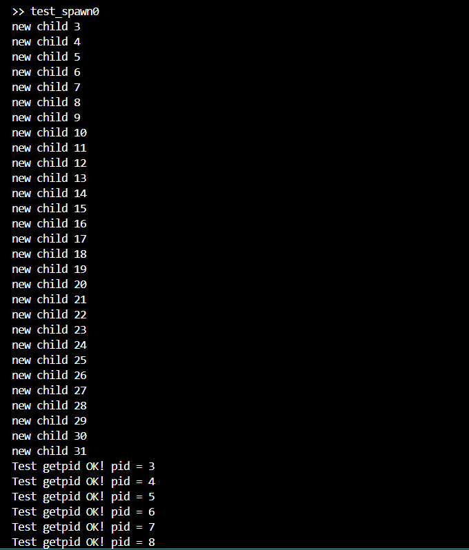
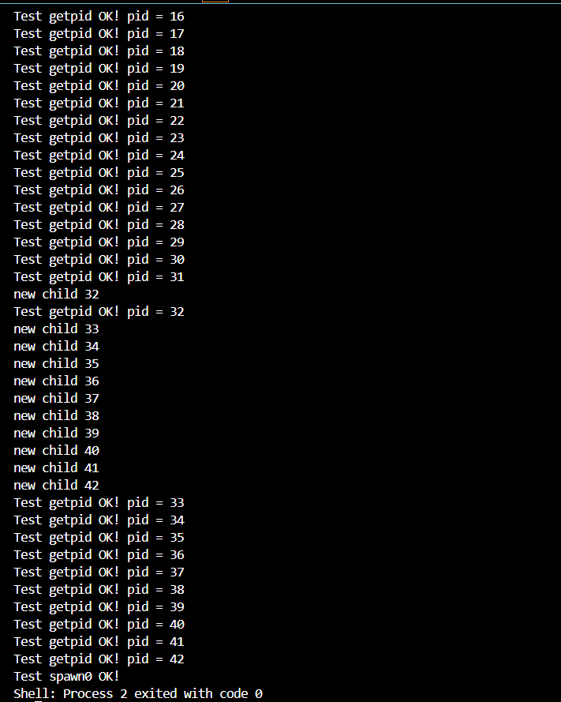
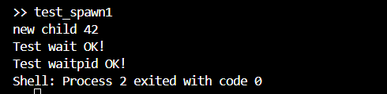

# rCore 实验二报告

## 1. 实验概述
本实验基于 `rCore-Tutorial` 实验指导手册，使用的是rcore v3的代码框架，目标是理解 rCore 操作系统的基本框架，并成功运行 `ch5-lab` 相关代码。

## 2. 代码理解
### 2.1 实验环境
- **开发环境**：
  - 操作系统：Ubuntu 24.04（WSL / 虚拟机）
  - 编程语言：Rust + RISC-V 交叉编译工具链
  - 主要依赖：`rustup`、`cargo`、`qemu`

- **代码结构分析**：
  ```markdown
  ├── os/
  │   ├── src/           # 内核源代码
  │   ├── Cargo.toml     # Rust 依赖管理
  │   ├── Makefile       # 编译脚本
  │   ├── target/        # 编译输出


## 3. 对实验指导手册内容的理解
### 3.1 进程概念及重要系统调用
#### 3.1.1 进程的定义与特性
在前面的章节中，已经了解了“任务”的概念，即正在执行的程序。然而，进程（Process）是一个更为复杂和动态的概念。它不仅仅是程序的执行实例，更是操作系统在管理下对程序的一次完整执行过程的抽象。
进程的关键特性包括：

动态性：进程具有生命周期，从创建、执行到终止，体现了程序的动态执行过程。
资源占用：进程在执行过程中会占用CPU、内存等硬件资源。
独立性：每个进程拥有独立的地址空间和资源，彼此之间相互隔离。

通过引入进程的概念，操作系统能够更有效地管理和调度程序的执行，提高系统的并发性和资源利用率。
#### 3.1.2 类 Unix 进程模型
rCore 教程中实现了一个简化的类 Unix 进程模型，主要包括以下系统调用：
fork：创建一个新的子进程，子进程是父进程的副本。
exec：在当前进程中执行一个新的程序，替换原有的进程映像。
waitpid：等待子进程的终止，并回收其资源。
这些系统调用使得进程的创建、执行和终止变得灵活和可控，支持多进程的并发执行。

### 3.2 进程管理的核心数据结构
#### 3.2.1 应用的链接与加载支持
为了支持基于应用名而非应用ID来查找应用ELF可执行文件，rCore对应用加载机制进行了重构。
基于应用名的应用链接：通过在编译阶段将所有用户程序的ELF文件链接到一个统一的内存区域，并生成符号表，内核可以根据应用名快速定位对应的ELF文件。还有基于应用名的应用加载器：内核提供了根据应用名加载对应ELF文件的机制，支持动态创建进程。


#### 3.2.2 进程标识符和内核栈
进程标识符（PID）：每个进程在创建时被分配一个唯一的PID，用于标识和管理进程。
内核栈：每个进程拥有独立的内核栈，用于在内核态执行系统调用或中断处理时保存上下文。内核栈的管理确保了进程间的隔离和安全。

#### 3.2.3 进程控制块（PCB）
PCB是操作系统用于管理进程的核心数据结构，包含以下信息：
进程状态：如就绪、运行、阻塞等。
内存空间信息：包括页表、代码段、数据段等。
文件描述符表：记录进程打开的文件信息。
父子进程关系：用于实现进程间的层级管理。
信号处理信息：用于处理异步事件。

PCB的设计使得操作系统可以高效地进行进程调度、切换和资源回收。
#### 3.2.4 任务管理器
TaskManager是内核中负责管理所有进程的组件，主要功能包括：
进程调度：根据调度算法选择下一个要运行的进程。
进程创建与销毁：管理进程的生命周期。
进程状态管理：维护进程的状态信息，支持状态转换。
TaskManager通过维护一个进程队列，实现了多进程的并发执行。

### 3.3 进程管理机制的设计实现

#### 3.3.1 进程创建与初始化
在操作系统中，进程的创建是通过系统调用 fork 实现的。当一个进程调用 fork 时，操作系统会创建一个新的进程控制块（PCB），并复制父进程的上下文信息，包括内存空间、寄存器状态等。新的进程被添加到就绪队列中，等待调度器的调度。

#### 3.3.2 进程调度与切换
操作系统通过调度器来管理多个进程的执行。调度器根据一定的策略（如时间片轮转）选择下一个要运行的进程。在进程切换时，操作系统需要保存当前进程的上下文（如寄存器状态、程序计数器等），并恢复下一个进程的上下文，以实现进程的切换。

#### 3.3.3 系统调用与异常处理
用户进程通过系统调用与操作系统进行交互。当用户进程执行系统调用指令（如 ecall）时，会触发异常，进入内核态。操作系统的异常处理机制会捕获这些异常，根据异常类型调用相应的处理函数，完成系统调用的功能。


### 3.4 进程调度
#### 3.4.1 调度的触发时机
在rCore中，进程调度主要在以下两种情况下被触发：
时间片耗尽：当一个进程的时间片用完时，系统会触发 SupervisorTimer 中断，进而调用调度器进行进程切换。
主动让出CPU：进程可以通过调用 sys_yield 系统调用主动让出CPU，触发调度器选择下一个进程执行。

这两种机制确保了系统能够在不同场景下合理地进行进程切换，提高了系统的响应性和资源利用率。

#### 3.4.2 调度算法
实验手册讲述了了多种调度算法，以满足不同的系统需求：
轮转调度（Round-Robin, RR）：为每个进程分配固定的时间片，时间片用完后将进程放回就绪队列尾部，适用于分时系统。
优先级调度：根据进程的优先级进行调度，优先级高的进程先执行。
多级反馈队列调度（MLFQ）：将进程根据其行为动态调整到不同的优先级队列中，适用于需要兼顾响应性和吞吐量的系统。

这些调度算法各有特点，系统可以根据具体需求选择合适的算法。
Clock（二次机会）：对LRU的工程近似，兼顾效果与效率。

## 4. 实践作业的完成过程及运行结果
这个作业相对简单，只需要把代码框架中的sys_fork和sys_execve系统调用中的代码复用一下即可

成功运行测试用例截图如下：




## 5. 遇到的问题及解决方法
这个实验不难，没遇到啥问题


